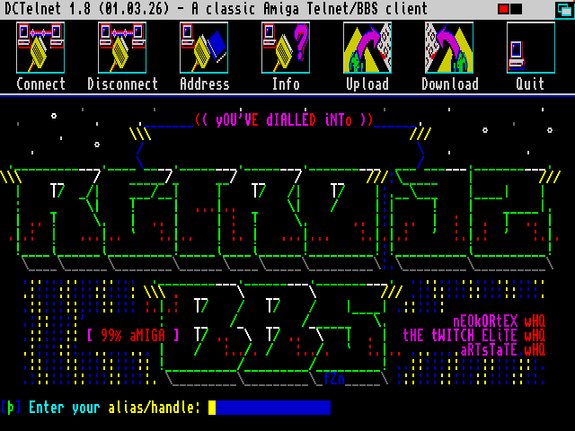

# DCTelnet
### A classic *𝔸miga* Telnet/BBS client with Zmodem

**DCTelnet** is a Telnet client for Commodore **Amiga** computers.
It is **easy to use**, **lightweight**, and **reliable**.

**DCTelnet** is ideal for accessing **Telnet-enabled BBS systems** on classic
**Amiga hardware**, and supports **file transfers via ZModem**.

---

> **Note:** This repository provides recompiled versions of DCTelnet,
> including a **68000-compatible binary** for classic Amiga systems
> (A500, A600, A2000), as well as an **optimized 68020 build**.
>
> **DCTelnet** was originally written by **Zed**. As of January 2026, the
> DCTelnet 1.5/1.6 releases available on Aminet target 68020+ CPUs only.
>
> This new release also offers **simplified installation** and **improved documentation**.
>
> 🎨 **Help wanted: UI icons**
>
> To give DCTelnet a more modern look, I’m looking for help to design a new set of toolbar icons.
> If you have pixel-art or icon design skills, your help would be greatly appreciated.
> See [issue #6](https://github.com/bruno-frederic/dctelnet/issues/6) for details.

---

## ✨ Features

- **68000** compatible (no 68020 required)
- **ZModem** upload & download using **XPR libraries**
- Fast and efficient design : DCTelnet access the bsdsocket API directly
- Address book with username & password entries
- Additional terminal emulations via **XEM libraries**
- User-definable screen modes, fonts & colour palettes
- Iconify support
- **multiple simultaneous Telnet connections**
- **No MUI, ClassAct or ReAction required**
- **No `telser.device` required**

---

## ⚙️ Requirements

- Kickstart / Workbench **v2.00 (V36)** or higher
- A TCP/IP stack: **AmiTCP**, **Miami**, UAE bsdsocket.library or compatible
- **ReqTools** library

---

## 📦 Installation

1. Install the **ReqTools** library, available on Aminet:
   [util/libs/ReqToolsUsr](https://aminet.net/package/util/libs/ReqToolsUsr)

2. Download the DCTelnet package either from Aminet:
   [comm/tcp/DCTelnet](https://aminet.net/package/comm/tcp/DCTelnet)
   or from the [GitHub releases section](https://github.com/bruno-frederic/dctelnet/releases).

3. The DCTelnet archive includes an **Installer** script.
   When available, using the *Installer* tool is the recommended installation method.

---

### Manual installation

On older AmigaOS versions where the *Installer* tool is not present (for example, pre-3.1.4 systems), DCTelnet can be installed **manually**. In this case, copy the required files to their respective system directories:

- `DCTelnet/Devs/ibmcon.device` -> `DEVS:`
- Libraries from `DCTelnet/Libs` -> `LIBS:`
- Fonts from `DCTelnet/Fonts` -> `FONTS:`

The archive also includes an optional **GlowIcons** icon set, which can be used as a modern replacement for the original icons if desired.

---

## 📖 How to use

Please refer to the included **DCTelnet.guide** documentation for detailed
usage instructions. The guide is in **AmigaGuide** format and can be opened
with **MultiView** on AmigaOS.

---

## 🐞 Known Bugs

### Character display issues and font selection

If, after connecting to a BBS, some characters appear incorrect or garbled, this is usually related to the selected terminal font. Make sure the font matches the character set expected by the remote system.

Many PC-based BBSes require an **ANSI-compatible font** to properly display line art and ANSI graphics. In such cases, select the bundled **HyperANSI** font.

On **Amiga-based BBSes**, graphics are often designed for the classic **Topaz** font. This is the case, for example, on **Retro 32 BBS**.

**Important:**
After switching the terminal font, **quit DCTelnet and restart it** before reconnecting. This avoids the display issue described **below** and ensures correct rendering.

### Connection stuck after changing settings (fonts, XEM, screen mode)

After changing certain display-related settings (such as the **terminal font**, enabling the **XEM library**, or switching the **screen mode**) subsequent Telnet connection may appear to succeed, but **no output is displayed**. The status remains *Connected*, while the terminal window no longer shows any data.  [(issue #3)](https://github.com/bruno-frederic/dctelnet/issues/3)

This issue has been observed both with the original **DCTelnet 1.6** built in 2006-2008 and with recent recompilations.

**Workaround:**
After modifying any of these settings, **quit DCTelnet and restart it** before reconnecting. Otherwise, the session may remain stuck in a connected state with no visible output.

### Address Book may not be saved correctly

Changes made in the Address Book may not be saved correctly if fields are validated **using the mouse**. [(issue #4)](https://github.com/bruno-frederic/dctelnet/issues/4)

**Workaround:**
When editing Address Book entries:

- Press **Enter** after typing text in each field, **especially the password field**
- Or move to the next field using **Tab**, then press **Enter** before leaving the entry

### On AmigaOS / Kickstart 2.00 & 2.02

- The included `xprzmodem.library` fails to load on these OS versions.
  As a result, ZModem file transfers are not available on these OS versions.
  [(issue #5)](https://github.com/bruno-frederic/dctelnet/issues/5)
- **ReqTools 2.9a**, available on Aminet (`util/libs/ReqToolsUsr`), also fails to load.

  An older version of ReqTools is required:
  - **ReqTools v2.2**, available here:
    https://www.nic.funet.fi/pub/amiga/system/libraries/ReqTools-2.2-user.lha
  - Use the library found in the `libs13/` directory (version **38.390**).
  - Copy `reqtools.library` to the `LIBS:` directory.

For troubleshooting, it is recommended to launch **DCTelnet from the Shell** in order to see library initialization error messages.

---

## 🛠️ Build environment

**As of January 2026:**

- **IDE**: VS Code (on Windows)
- **Compiler**: SAS/C v6.58 under AmigaOS 3.2 (on WinUAE 6)

### Source code

All source code referenced below, including **DCTelnet 1.5 / 1.6** and its
required third-party libraries, is publicly available on **Aminet**.

- Based on the **DCTelnet 1.5 / 1.6** sources:
  [comm/tcp/dct16_src](https://aminet.net/package/comm/tcp/dct16_src)

The required third-party source code dependencies are also included:

- **ReqTools 2.9** from [util/libs/ReqToolsDev](https://aminet.net/package/util/libs/ReqToolsDev)
- **AmiTCP SDK 4.3** from [comm/tcp/AmiTCP-SDK-4.3](https://aminet.net/package/comm/tcp/AmiTCP-SDK-4.3)
- **XPRotocol v2.001** from [comm/term/xpr2001](https://aminet.net/package/comm/term/xpr2001)
- **Xem 2.0** from [comm/term/XEM2_0](https://aminet.net/package/comm/term/XEM2_0)

---

## 🙏 Credits

- **DCTelnet** was originally written by **Zed**.
- new 68000-compatible build by **Bruno FREDERIC**
- ReqTools is Copyright © Nico François and Magnus Holmgren

---

### ⚖️ License

The original **DCTelnet** code by Zed was released without an explicit license and remains *all rights reserved*. See [LICENSE file](LICENSE) for details.

This repository provides the source for preservation and maintenance only.
