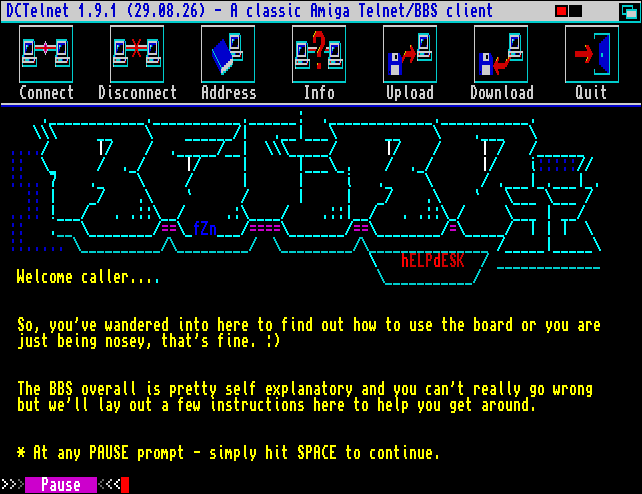

# DCTelnet

**DCTelnet** is a Telnet client for **Amiga** computers.
It is **easy to use**, **lightweight**, and **reliable**.

In fullscreen mode, DCTelnet is ideal for accessing **Telnet-enabled BBS systems** on classic
**Amiga hardware**, and supports **file transfers via ZModem**.

It is also perfect for regular Telnet usage thanks to its **windowed mode on Workbench**.

---

> **Note:** Starting with the v1.7 release in 2026, this repository provides
> recompiled versions of DCTelnet, including a **68000‑compatible binary**
> for classic Amiga systems (A500, A600, A2000 with KS 2.0 or higher), as
> well as an **optimized 68020 build**.
>
> **DCTelnet** was originally written by **Zed**. His latest releases
> (v1.5-1.6, published between 1998 and 2000) were compiled
> **for 68020+ CPUs only**.
>
> The new releases also offers **simplified installation**, **improved
> documentation** and **bug fixes**.

---

## 💬 Contact & Discussion

Want to chat, give feedback, or share your ideas about DCTelnet?

You can reach me on [Retro 32 BBS](https://www.retro32.com/retro32-bbs), where I go by *Bruno*,
or join the discussion on the [EAB forum thread](https://eab.abime.net/showthread.php?t=121939)

---

## ✨ Features

- **68000** compatible
- **ZModem** upload & download using XPR libraries
- Fast and efficient design : DCTelnet access the TCP/IP stack directly
- Flexible display modes: fullscreen, windowed on Workbench or minimizable/iconifiable
- Address book with username & password entries
- Additional terminal emulations via **XEM libraries**
- User-definable screen modes & fonts
- **multiple simultaneous** Telnet connections
- **No** MUI, ClassAct or ReAction required
- **No** `telser.device` required

---

## ⚙️ Requirements

- Kickstart / Workbench **v2.00 (V36)** or higher
- A TCP/IP stack: **AmiTCP**, **Roadshow**, **Miami**, UAE bsdsocket.library or compatible

---

## 📦 Installation

1. Download the DCTelnet package either from Aminet:
   [comm/tcp/DCTelnet](https://aminet.net/package/comm/tcp/DCTelnet)
   or from the [GitHub releases section](https://github.com/bruno-frederic/dctelnet/releases).

2. The DCTelnet archive includes an **Installer** script.
   When available, using the *Installer* tool is the recommended installation method.

---

### Manual installation

On older AmigaOS versions where the *Installer* tool is not present (for example, pre-3.1.4 systems), DCTelnet can be installed **manually**. In this case, copy the required files to their respective system directories:

- `DCTelnet/Devs/ibmcon.device` -> `DEVS:`
- Libraries from `DCTelnet/Libs` -> `LIBS:`
- Fonts from `DCTelnet/Fonts` -> `FONTS:`

On AmigaOS / Kickstart **2.00 & 2.02**, the default versions of
reqtools.library and xprzmodem.library fail to load.
Replace them with the following compatible versions:
- `DCTelnet/Libs-r36/reqtools.library` -> `LIBS:`
- `DCTelnet/Libs-r36/xprzmodem.library` -> `LIBS:`

---

## 📖 How to use

Please refer to the included **DCTelnet.guide** documentation for detailed
usage instructions.

It is in **AmigaGuide** format and can be opened directly on AmigaOS 3.*

On Amiga OS 2.*, the AmigaGuide tool is required (available on Aminet: [text/hyper/aguide34](https://aminet.net/package/text/hyper/aguide34)). In this case, update the "Default Tool" of the DCTelnet.guide icon to: SYS:Utilities/AmigaGuide

---

## 🐞 Known Bugs

### Character display issues and font selection

If some characters appear incorrect or garbled after connecting to a BBS, the issue is usually related to the selected terminal font. Make sure the font matches the character set expected by the remote system.

Many PC-based BBSes require an **IBM Code Page 437 (CP437)** font to display line-drawing characters and ANSI artwork correctly. In such cases, select one of the bundled IBM/ANSI fonts: *HyperANSI*, *IBM*, *P0T-IBM*, or *ANSEY*.

On **Amiga-based BBSes**, graphics are often designed for the classic **Topaz** font. This is the case, for example, on *Retro 32 BBS*.

### Rendering glitches and compatibility issues on several BBSes

Rendering issues occur on multiple BBSes, whether using ibmcon.device or
XemVT340.library for display. Some screens freeze, misalign the UI, or fail
to display animations.

Details on [GitHub issue #11](https://github.com/bruno-frederic/dctelnet/issues/11).

### Network issues with AmiBerry and FS-UAE on Linux

Connection issues have been reported when using the integrated TCP/IP stack provided by AmiBerry or FS-UAE under Linux. The problem appears to be specific to these emulators' bsdsocket.library implementations. Using a different IP stack resolves the issue.

Details on [GitHub issue #13](https://github.com/bruno-frederic/dctelnet/issues/13).

### Connection stuck after changing display settings (fonts, XEM, screen mode) or iconifying the application (fixed in v1.8)

This issue had existed since **DCTelnet 1.1** and occured when used with certain
versions of "bsdsocket.library", notably UAE bsdsocket.library 4.1 (WinUAE)
and Amiberry's built-in library.

Details on [GitHub issue #3](https://github.com/bruno-frederic/dctelnet/issues/3).

### Address Book Profile may not be saved correctly (fixed in v1.8)

This bug has been present at least since the original version 1.1 release (December 1997).

Details on [GitHub issue #4](https://github.com/bruno-frederic/dctelnet/issues/4).

### On AmigaOS / Kickstart 2.00 & 2.02 (fixed in v1.8)

The `xprzmodem.library` bundled with DCTelnet since v1.1 fails to load on these OS versions. [(issue #5)](https://github.com/bruno-frederic/dctelnet/issues/5)

Starting with v1.8, a compatible version of the library is included in the `Libs-r36/` directory.

---

## 🛠️ Build environment

**As of August 2026:**

- **IDE**: VS Code (on Windows)
- Docker/Podman running a telnetd container for testing
- **Compiler**: **VBCC** and **GNU Make** on Windows, using my custom toolchain :
  [vbcc-bin](https://github.com/bruno-frederic/vbcc-bin/tree/Bruno_toolchain)
- The project can also be built with SAS/C v6.58 under AmigaOS 3.2
- Icon Editor : IconEdit from AmigaOS 3.2.3

### Source code

All source code referenced below, including **DCTelnet 1.5 / 1.6** and its
required third-party libraries, is publicly available on **Aminet**.

- Based on the **DCTelnet 1.5 / 1.6** sources:
  [comm/tcp/dct16_src](https://aminet.net/package/comm/tcp/dct16_src)

The required third-party source code dependencies are also included:

- **ReqTools 2.9** from [util/libs/ReqToolsDev](https://aminet.net/package/util/libs/ReqToolsDev)
- **XPRZModem 3.1** library and sources from "comm/misc/xprz31.lha" package on Aminet CD 2
- **Xem 2.0** from [comm/term/XEM2_0](https://aminet.net/package/comm/term/XEM2_0)

---

## 🙏 Credits

- **DCTelnet** was originally written by **Zed**.
- new 68000-compatible build by **Bruno FREDERIC**
- ReqTools is Copyright © Nico François and Magnus Holmgren

---

### ⚖️ License

The original **DCTelnet** code by Zed was released without an explicit license and remains *all rights reserved*. See [LICENSE file](LICENSE) for details.

This repository provides the source for preservation and maintenance only.
